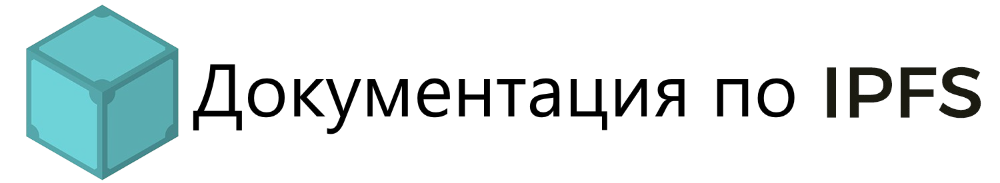

<p align="center">

</p>

<div align="center">
<h3> IPFS обеспечивает существование распределённой сети </h3>
<br>

[](https://protocol.ai/)
[](http://ipfs.tech/)
[](https://circleci.com/gh/ipfs/ipfs-docs)

</div>

<!-- TOC -->
- [Настройка проекта](#настройка-проекта)
  - [Локальный запуск](#локальный-запуск)
  - [Решение проблем](#решение-проблем)
    - [Digital envelope routines initialization error](#digital-envelope-routines-initialization-error)
- [Внесение правок в документацию](#внесение-правок-в-документацию)
  - [Проблемы](#проблемы)
  - [Баунти](#баунти)
  - [Предложения](#предложения)
  - [Свободно отправляйте pull requests](#свободно-отправляйте-pull-requests)
- [Руководства по стилям и настройкам](#руководства-по-стилям-и-настройкам)
  - [Генератор статических сайтов](#генератор-статических-сайтов)
  - [Automated deployments](#automated-deployments)
  - [Translation](#translation)
- [Core members](#core-members)
- [License](#license)
<!-- /TOC -->

---
Добро пожаловать в официальную документацию IPFS. Межпланетная файловая система (IPFS) представляет собой распределенную одноранговую сеть для хранения и доступа к файлам, веб-сайтам, приложениям и данным. Protocol Labs является основным владельцем документации по IPFS и будет проверять все запросы и pull requests, созданные в этом репозитории.

**Если вы хотите просто изучить документацию по IPFS, рекомендуем перейти на [сайт документации](https://docs.ipfs.tech).**

## Настройка проекта

### Локальный запуск

Для локального запуска сайта выполните следующие действия.

1. Клонируйте этот репозиторий:

   ```bash
   git clone https://github.com/ipfs/ipfs-docs.git
   ```

2. Перейдите в папку `ipfs-docs` и установите зависимости NPM:

   ```bash
   cd ipfs-docs
   npm install
   ```

3. Загрузите приложение в режиме _dev mode_:

   ```bash
   npm start
   ```

4. Откройте в браузере [localhost:8080](http://localhost:8080).
5. Закройте локальный сервер нажатием `CTRL` + `c`.
6. Чтоб перезапустить локальный сервер, выполните `npm start` из папки `ipfs-docs`

### Решение проблем

Если у вас возникли проблемы с настройкой локального сайта, изучите этот раздел с решениями распространенных проблем.

#### Digital envelope routines initialization error

При первом развертывании этого проекта с использованием Node.js версии 18.0.0 может вылезти следующая ошибка:

   ```shell
   opensslErrorStack: [ 'error:03000086:digital envelope routines::initialization error' ],
   library: 'digital envelope routines',
   reason: 'unsupported',
   code: 'ERR_OSSL_EVP_UNSUPPORTED'
   ```

Для исправления этой ошибки выполните следующие действия:

1. Откройте терминал.
2. Перейдите в папку `ipfs-docs`:

   ```bash
   cd ipfs-docs
   ```

3. Выполните вот такую команду:

   ```shell
    export NODE_OPTIONS=--openssl-legacy-provider
   ```

4. Запустите `npm start`.

   ```bash
   npm start
   ```

Вы можете вернуться в раздел [Настройка проекта](#настройка-проекта) и выполнить другие действия. Либо в поисках дополнительной информации можете почитать про [эту ошибку в репозитории Webpack GitHub](https://github.com/webpack/webpack/issues/14532).

## Внесение правок в документацию

Мы будем **рады ❤️ вашей помощи** с улучшением существующих вещей и с созданием новых еще более крутых штук! [А ещё у нас бывают баунти](https://github.com/ipfs/devgrants/projects/1)!

### Проблемы

Если вы обнаружили, что в этом репозитории что-то работает неправильно, то, пожалуйста, напишите [сюда →](https://github.com/ipfs/ipfs-docs/issues). Если исправление ошибки не является срочной необходимостью, то обновляющие объединения с `main` происходят по вторникам или четвергам.

### Баунти

Вы снискаете всеобщую вечную любовь сообщества IPFS _и_, возможно даже, материальное вознаграждение, решая вопросы, задачи и проблемы, отмеченные тегом [`bounty`](https://github.com/ipfs/ipfs-docs/issues?q=is%3Aopen+is%3Aissue+label%3Abounty). Притом всё должно быть работоспособно и соответствовать всем требованиям, описанным на соответствующей странице этой задачи или вопроса. Перед началом работы изучите [список активных баунти](https://github.com/ipfs/devgrants/projects/1).

Если вы пытаетесь решить какой-то вопрос, то отлично! Спасибо вам за помощь! Обязательно оставьте комментарий **перед** отправкой в pull request. Тогда вероятность того, что для решения одной задачи будет отправлено несколько pull request, будет минимальной. Если вы делаете pull request в задачу _не будучи_ предварительно назначенным в неё, ваш запрос может быть отклонён.

### Предложения

Когда дело доходит до документации, у каждого появляется своё видение и мнение - и **это хорошо**! Участие людей из разных слоев общества и с разной компетенцией в обсуждении позволяет участникам шире взглянуть на многие вещи. Поэтому, если вам есть что добавить и о чём рассказать, или вы хотите в документации что-то обсудить, то добро пожаловать! Создайте тему, используя тег [`kind/question`](https://github.com/ipfs/ipfs-docs/issues?q=is%3Aopen+is%3Aissue+label%3Akind%2Fquestion).

### Свободно отправляйте pull requests

Если у вас есть какие-то дополнения, то свободно запрашивайте pull request. Если вы просто предлагаете исправление в слове или стилистическую правку, добавьте `ciskip` в заголовок вашего запроса, чтобы остановить Filecorgi. После объединения сайт автоматически обновится в течение 5-10 минут.

## Руководства по стилям и настройкам

Описания процесса создания стиля или шаблона также могут использоваться другими пользователями в качестве руководств.

### Генератор статических сайтов

Сайт документации IPFS использует [генератор статических веб-сайтов Vue Press](https://vuepress.vuejs.org/)
The IPFS documentation site uses the [VuePress static website generator](https://vuepress.vuejs.org/) to convert the Markdown guides into a documentation website. All the documentation is written in Markdown; follow the [VuePress Markdown documentation](https://vuepress.github.io/guide/markdown.html) for information on how to write markdown files for VuePress.

### Automated deployments

When opening a pull request, CI scripts will run against your feature branch to test your changes.

The CI/CD production workflow builds on the `main` branch and deploys the documentation site on [fleek](https://fleek.co/). The site reflects the latest commit on `main`.

### Translation

Please stay tuned on the steps to translate the documentation.

## Core members

- [@johnnymatthews](https://github.com/johnnymatthews): Project leadership, organization, and primary contact
- [@cwaring](https://github.com/cwaring): Development support

## License

All software code is copyright (c) Protocol Labs, Inc. under the **MIT license**. Other written documentation and content are copyright (c) Protocol Labs, Inc. under the [**Creative Commons Attribution-Share-Alike License**](https://creativecommons.org/licenses/by/4.0/).
